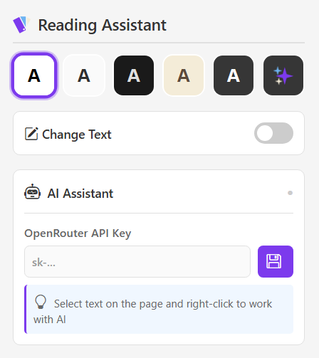
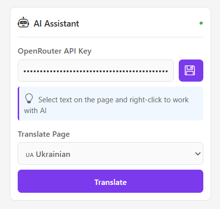
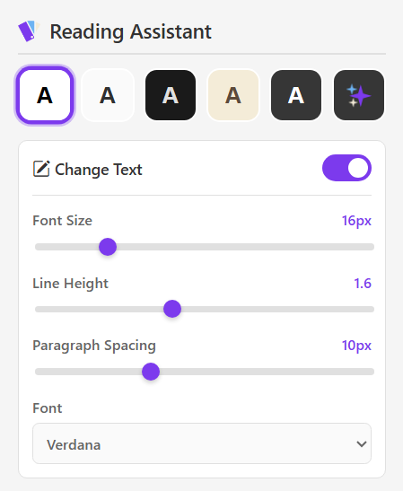
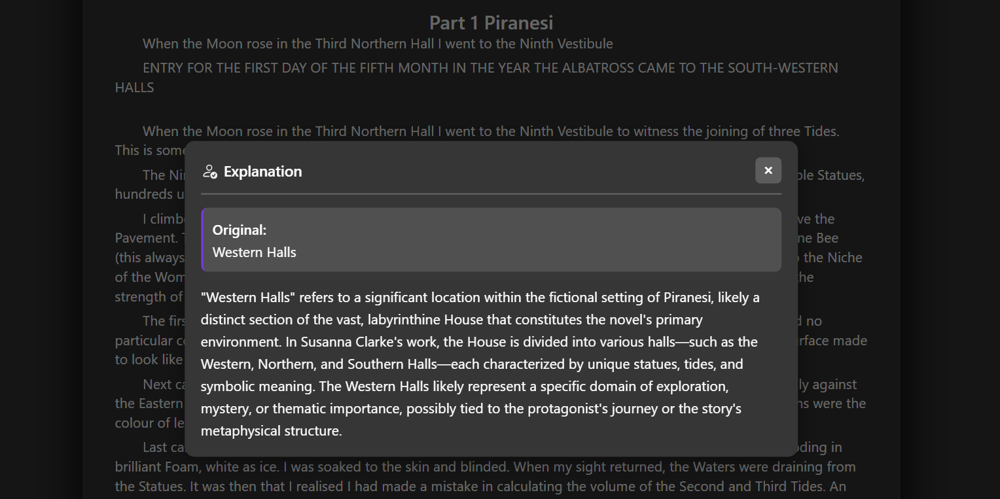
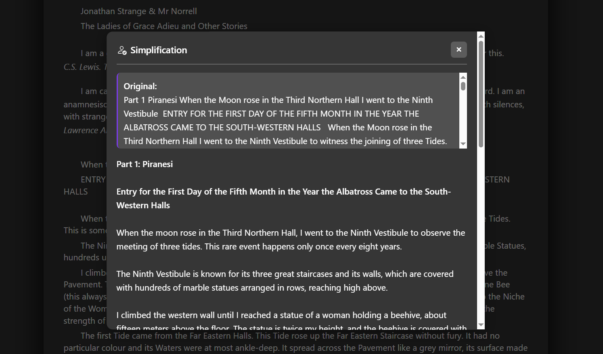
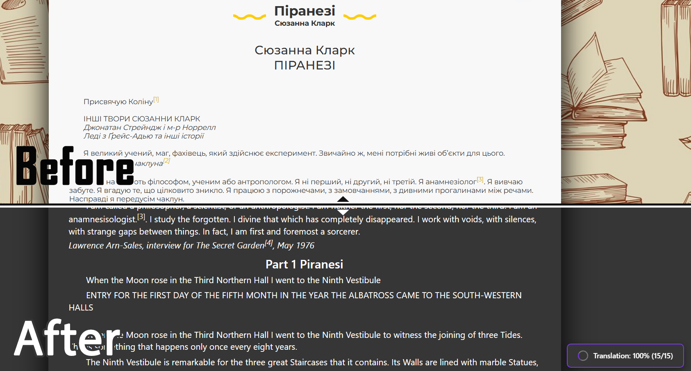

# Reading Theme-Changer with AI Assistant

A Google Chrome browser extension that improves the reading experience of web content through visual personalization, text customization, and AI-powered features (explanation, simplification, summarization, and translation).

---

## Key Features

   
  <em>Main interface</em>

- Predefined reading themes for better comfort
- Flexible text typography customization
- AI processing of selected text:
  - simplification
  - explanation
  - summarization
- Automatic page translation
- Per-domain settings persistence
- Quick access to AI features via the context menu
- Works without registration and stores data locally

---

## Installation (Local)

1. Clone the repository or download it as a ZIP archive
2. Extract the archive to any folder
3. Open `chrome://extensions/` in Google Chrome
4. Enable **Developer mode**
5. Click **Load unpacked**
6. Select the extension folder

After installation, the extension icon will appear in the browser toolbar.

---

## First Launch & AI Features

   
  <em>AI Assistant settings with API key configuration</em>

- Basic theme and text customization features are available immediately
- To enable AI features, an OpenRouter API key is required
- Open the **AI Features** section in the popup window
- Enter the API key in the format `sk-or-v1-...` and save it
- By default, the model `deepseek/deepseek-chat-v3.1` is used
- If needed, the model can be changed in the `background.js` file by replacing  
  `model: 'deepseek/deepseek-chat-v3.1'`  
  with any other OpenRouter model that uses the same API call format

The API key is stored locally in `chrome.storage.local` and is used only for direct requests to the OpenRouter API.

---

## Text Customization

   
  <em>Text formatting controls: font size, line height, spacing, and font family</em>

Adjust text parameters to your preferences:
- Font size (10-32px)
- Line height (1.0-2.5)
- Paragraph spacing (0-30px)
- Font family selection

All settings are saved per domain automatically.

---

## Using AI via the Context Menu

   
  <em>AI explanation feature displaying detailed context about selected text</em>

1. Select text on a web page
2. Right-click to open the context menu
3. Choose one of the options:
   - Simplify text
   - Explain text
   - Summarize text
4. The result will be displayed in a modal window

   
  <em>AI simplification showing original and simplified versions side by side</em>

---

## Automatic Page Translation

   
  <em>Translation in progress: Ukrainian text being translated to English in real-time</em>

- Select the target language in the popup window
- Click **Translate page**
- The translation is performed progressively in blocks
- You can read the translated content while the process is ongoing
- Translation progress is displayed at the bottom right corner

---

## Privacy

- All settings are stored locally
- No data is shared with third parties
- The API key can be changed or removed at any time

---